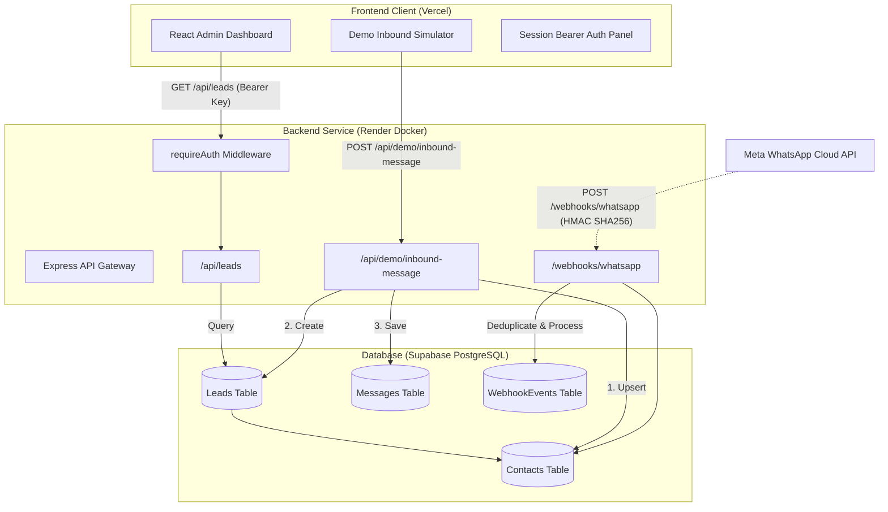

# MindClub WhatsApp CRM MVP

An end-to-end CRM Minimum Viable Product (MVP) engineered for **MindClub Foundation** to streamline WhatsApp-driven customer inquiries, lead capture, conversation tracking, and follow-up pipeline management.

---

## 🌐 Live Project URLs

- **Frontend Dashboard (Production)**: [https://whatsapp-crm-backend-rose.vercel.app/](https://whatsapp-crm-backend-rose.vercel.app/)
- **Backend API Base URL**: [https://whatsapp-crm-backend-1-8j7r.onrender.com](https://whatsapp-crm-backend-1-8j7r.onrender.com)
- **Backend Health Check**: [https://whatsapp-crm-backend-1-8j7r.onrender.com/health](https://whatsapp-crm-backend-1-8j7r.onrender.com/health)

---

## 📌 Short Summary

- **What it is**: A fully functional, cloud-deployed CRM system built with a decoupled frontend and backend.
- **Frontend**: Hosted on **Vercel**, delivering a modern two-column admin dashboard with real-time pipeline status tracking.
- **Backend**: Hosted on **Render** (Node.js + Express + TypeScript containerized via Docker).
- **Database**: Cloud **PostgreSQL** hosted on **Supabase**, modeled and managed with Prisma ORM.
- **Simulation Mode**: Uses an integrated **Inbound Message Simulator** to replicate WhatsApp webhook events without requiring live Meta developer credentials.
- **Ready for Production**: Built on modular architecture so the same webhook and database layer can be connected to the official **Meta WhatsApp Cloud API** with zero schema redesign.

---

## 💡 What Problem This Solves

Modern organizations and educational foundations like MindClub receive hundreds of inquiries through WhatsApp regarding courses, counseling, workshops, and memberships.

1. **Lost & Scattered Leads**: Inquiries stay locked inside personal WhatsApp chats or phone logs without central tracking.
2. **Delayed Follow-ups**: Teams lack immediate visibility into which inquiries are new, in progress, or pending response.
3. **No Centralized History**: Customer interaction histories and contact details are not linked to a unified CRM database.

**The Solution**: This CRM captures incoming inquiries, automatically upserts contacts, creates structured sales/support leads, logs messages chronologically, and allows administrators to track and update lead stages from an intuitive dashboard.

---

## ✨ Current Features

- **Responsive Web Dashboard**: Clean two-column layout styled after modern fintech design systems with dark/neutral contrast and micro-animations.
- **Bearer API Key Authorization**: Sensitive CRM endpoints (`GET /api/leads`, `PATCH /api/leads/:id/status`) are protected by a timing-safe API secret key stored securely in `sessionStorage`.
- **Live Lead Records**: Displays full contact details (name, phone number, program title, inquiry notes, creation timestamp, and lead ID).
- **Interactive Status Management**: Real-time dropdown to update lead stages (`new`, `contacted`, `interested`, `follow_up_required`, `converted`, `closed`) with live database sync.
- **Dynamic Metric Summary Cards**: Top-level analytics displaying **Total Leads**, **New Leads**, **Contacted**, and **Converted**.
- **Inbound Message Simulator**: Built-in test form with one-click presets ("Counseling", "Masterclass") simulating incoming WhatsApp customer inquiries.
- **Automatic Contact Upserting**: Prevents duplicate contact creation by indexing phone numbers and associating new messages with existing profiles.
- **Message Audit Log**: Saves inbound messages with provider message IDs and timestamps in Supabase PostgreSQL.
- **WhatsApp Webhook Ready**: Implements both verification challenge (`GET /webhooks/whatsapp`) and HMAC SHA-256 signature verification (`POST /webhooks/whatsapp`) with deduplication.
- **Priority 0 Security Hardening**: Timing-safe authentication comparison, foreign-key relationship fixes, webhook idempotency, and strict CORS configuration.

---

## 🛠️ Tech Stack

### Frontend
- **Framework**: React 19 + TypeScript
- **Bundler & Tooling**: Vite
- **Styling**: Tailwind CSS v4
- **Icons**: Lucide React
- **Hosting**: Vercel

### Backend
- **Runtime**: Node.js (v22 / v24)
- **Framework**: Express.js with Modular Routing
- **Language**: TypeScript (Strict Mode)
- **ORM**: Prisma ORM with Formal SQL Migrations
- **Database**: PostgreSQL (Hosted on Supabase)
- **Validation**: Zod (Runtime Schema Validation)
- **Logging**: Pino (Structured JSON Logging)
- **Deployment**: Render (Docker Container)

### Testing & DevOps
- **Unit & Integration Tests**: Jest + Supertest
- **Containerization**: Multi-stage Dockerfile (Alpine Linux)
- **Version Control**: Git + GitHub
- **Continuous Deployment**: Automated Git-push deployments to Render and Vercel

---

## 🏗️ Architecture Overview

### 1. Inbound Simulation Flow (Current MVP Mode)
1. User fills out the Inbound Simulator form on the dashboard (or clicks a preset like "Counseling").
2. Frontend sends `POST /api/demo/inbound-message`.
3. Backend checks if the contact phone number exists in PostgreSQL:
   - If not found, a new **Contact** record is created.
   - If found, the contact name is updated.
4. Backend checks for open leads; if none exist, a new **Lead** is created with status `new`.
5. An inbound **Message** record is stored with a unique simulated WhatsApp ID (`demo_wamid_...`).
6. The dashboard receives confirmation and automatically refreshes summary metrics and lead records.

### 2. Future Live WhatsApp Webhook Flow
1. A customer sends a WhatsApp message to the MindClub business phone number.
2. Meta sends an HTTPS POST payload to `https://whatsapp-crm-backend-1-8j7r.onrender.com/webhooks/whatsapp`.
3. Backend validates the payload signature using HMAC SHA-256 and the Meta App Secret.
4. Backend checks for duplicate event IDs (`providerEventId`) to ensure idempotency.
5. Inbound text is extracted, contact is upserted, lead is created, and message is stored.
6. The CRM dashboard displays the live customer lead.

---

## 🎬 Live Demo Flow for Presentation

Follow this sequence during your presentation:

1. **Show the Live Frontend**:
   - Open [https://whatsapp-crm-backend-rose.vercel.app/](https://whatsapp-crm-backend-rose.vercel.app/).
   - Highlight the **Backend Live** green badge showing connection to Render.

2. **Demonstrate API Key Protection**:
   - Point out that lead data is securely locked by default.
   - In the left panel, click **Fill Demo Key** and **Save Key** (or enter the private key).
   - Show how the badge changes to `Saved` and the dashboard unlocks.

3. **Explore Existing Pipeline**:
   - Review the 4 Summary Cards (**Total Leads**, **New Leads**, **Contacted**, **Converted**).
   - Review existing leads loaded from the cloud database.

4. **Simulate a Live WhatsApp Customer Enquiry**:
   - In the **Inbound Simulator**, click a sample preset (e.g., **"Counseling"** or **"Masterclass"**).
   - Click **Send WhatsApp Demo Enquiry**.
   - Show the success banner: Contact upserted, Lead created, Message stored.

5. **Show Real-Time Dashboard Updates**:
   - Point out that the new lead immediately appears at the top of the table.
   - Show the **New Leads** metric incrementing automatically.

6. **Demonstrate Pipeline Status Update**:
   - Change the lead's status from `new` to `contacted` or `interested` using the dropdown.
   - Show the instant status toast and how the **Contacted** metric increments in real time.

7. **Show Backend Health Endpoint**:
   - Open [https://whatsapp-crm-backend-1-8j7r.onrender.com/health](https://whatsapp-crm-backend-1-8j7r.onrender.com/health) in a new tab to show the JSON response (`{"ok":true,"service":"crm-whatsapp-integration"}`).

8. **(Optional) Show Database Records**:
   - If showcasing the database, open Supabase Table Editor to show records in `Contact`, `Lead`, and `Message` tables.

---

## 🔒 Important Security Notes

- **Zero Secrets Committed**: No private API keys, database connection strings, or passwords are stored in this repository or client-side code.
- **Private Key Handling**: When demonstrating or recording the screen, do not expose production API secrets. Use the built-in password masking toggle.
- **Environment Variables**: Sensitive configuration (`DATABASE_URL`, `API_SECRET_KEY`, `WHATSAPP_APP_SECRET`) is managed strictly through Render and Vercel environment variable settings.
- **Key Rotation**: If an API key is ever accidentally exposed, immediately rotate it in the Render dashboard and redeploy.
- **Demo Endpoint Hardening**: The `/api/demo` route is guarded to only run in development/demo environments and will return `404 Not Found` when `NODE_ENV=production`.
- **Future Authentication**: For multi-tenant production use, transition from a single Bearer key to multi-user Supabase Auth with JWT and Row Level Security (RLS).

---

## 📚 What I Learned

Building this MVP provided deep hands-on experience across full-stack architecture:

- **CRM Data Modeling**: Structuring relational schemas separating Contacts (real people), Leads (business opportunities), and Messages (conversations).
- **Full-Stack Decoupling**: Building an independent React client and Express API communicating over clean REST standards with CORS protection.
- **Database Engineering**: Utilizing Prisma with Supabase PostgreSQL, creating formal SQL migrations, and handling foreign key relationships properly.
- **Security Engineering**: Implementing timing-safe cryptographic comparisons (`crypto.timingSafeEqual`) to eliminate timing attacks on token verification.
- **Webhook Protocol**: Mastering the Meta WhatsApp webhook lifecycle, including challenge-response verification (`hub.challenge`) and HMAC SHA-256 payload validation.
- **Simulation-Driven Development**: Developing an inbound simulator to completely build and test an end-to-end CRM workflow prior to receiving live Meta API credentials.
- **Modern Cloud DevOps**: Deploying containerized Docker backends to Render, static applications to Vercel, and configuring continuous deployment via Git.
- **Environment Management**: Handling configuration securely without exposing production secrets in Git history.

---

## ⚠️ Current Limitations

- **Simulated Inbound**: Real Meta WhatsApp Cloud API credentials are not yet linked; inquiries are currently generated via the tested demo endpoint.
- **No Direct Outbound Messaging**: The dashboard currently updates lead pipeline stages, but sending direct outbound WhatsApp replies requires a registered WhatsApp Business Phone Number ID.
- **Single-Key Authentication**: Uses an administrative Bearer API key rather than multi-user role-based logins.
- **Render Free-Tier Spin Down**: On Render's free tier, the backend container sleeps after 15 minutes of inactivity; initial requests may take 20-30 seconds to wake up (cold start).
- **Basic Telemetry**: Includes structured Pino logging, but does not yet integrate full application performance monitoring (e.g., Sentry, Datadog).

---

## 🚀 Next Steps

1. **Meta WhatsApp Cloud API Connection**:
   - Provide Meta System User Access Token, WhatsApp Business Phone Number ID, and App Secret.
   - Configure the live callback URL (`https://whatsapp-crm-backend-1-8j7r.onrender.com/webhooks/whatsapp`) in the Meta Developer Console.
2. **Outbound Messaging**:
   - Implement WhatsApp template messages and direct chat responses from the CRM workspace.
3. **User Authentication & Roles**:
   - Integrate Supabase Auth to provide multi-user logins for counselors, admins, and support staff.
4. **Interactive Chat Inbox**:
   - Expand the UI to include a complete two-way WhatsApp conversation view for each contact.
5. **Production Hardening**:
   - Move Render service to a persistent instance to eliminate cold starts.
   - Disable demo simulation routes in strict production mode.
6. **Analytics & Export**:
   - Add date-range filtering, CSV lead export, and conversion rate reports.

---

## 🎯 Presentation Statement

> *"This MVP proves the core CRM workflow: enquiry capture, contact creation, lead creation, message storage, and follow-up tracking. It is currently operating in demo simulation mode, but the entire backend architecture, database schema, and webhook verification pipeline are production-ready to connect with the live WhatsApp Cloud API as soon as Meta credentials are provided."*

---

*Built for MindClub Foundation.*
